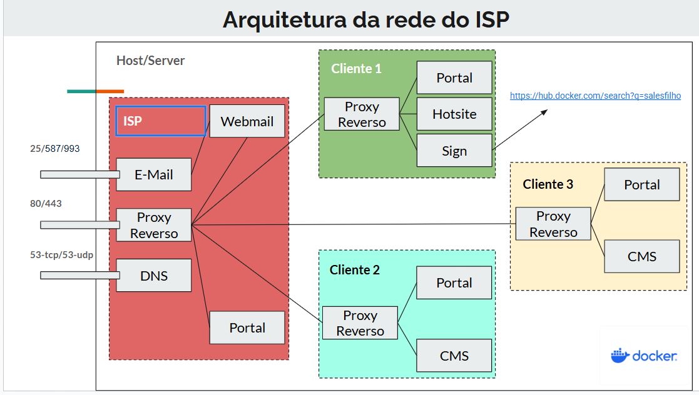

# Implementação de Provedor de Serviços de Internet Usando Micro Serviços

## Arquitetura do projeto



## Diagrama Inicial
- Arquitetura de todo o projeto.
````
isp/
│
├── core/
│ ├── dns/
│ ├── email/
│ ├── webmail/
│ ├── proxy-reverso/
│ ├── portal/
│ └── isp-core/
│
├── clientes/
│ ├── cliente1/
│ │ ├── proxy/
│ │ ├── portal/
│ │ ├── hotsite/
│ │ └── sign/
│ │
│ ├── cliente2/
│ │ ├── proxy/
│ │ ├── portal/
│ │ └── cms/
│ │
│ └── cliente3/
│ ├── proxy/
│ ├── portal/
│ └── cms/
│
├── deploy/
│ ├── compose-core.yml
│ ├── compose-cliente1.yml
│ ├── compose-cliente2.yml
│ ├── compose-cliente3.yml
│
└── docs/
| ├──Atas_reuniao/
| ├──images/
└── README.md
````

## Sprint 1

**Implementado e testado DNS**


**Implementado e testado portal**


